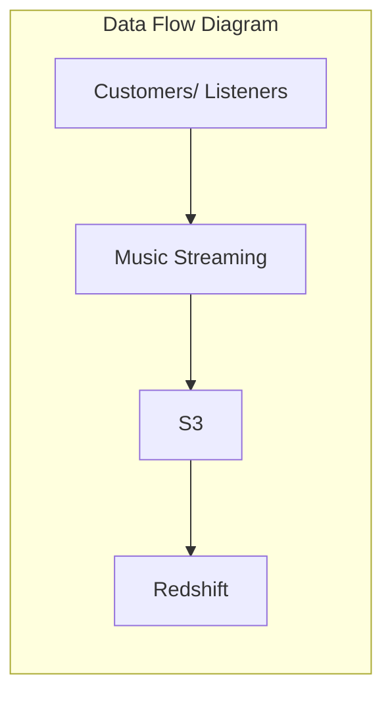
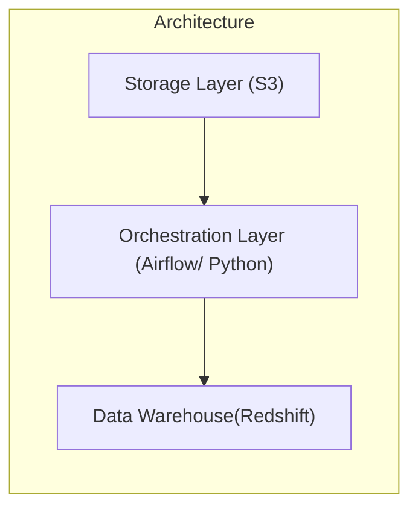

# Batch-Ingestion-orchestration-using-AWS-Airflow-Redshift

# Tech Stack
1. AWS Airflow - Data orchestration & transformation
2. AWS Redshift Serverless -  Data Warehouse
3. S3- Storage layer/ Data Lake

# Use case

Batch Ingestion & orchestration using AWS Airflow & Redshift

# Project Introduction

For a music straming platform where we have thousands of users streaming music off to the platform. This data is uploaded to S3 bucket on a frequent basis, I have to generate a report out of this data
For reporting and analytical use cases, I need to store the data either in a data lake in a way that it can be queried on a data warehouse.

# Solution Architecture

Redshift is the cloud data warehouse offering on AWS.
For storage layer, I am using S3 bucket. For the data orchestration layer which also handles the data transformation using airflow with Python and Pandas, this layer handles the sequence of steps to be executed, such as i/p, data validation, data cleaning and transformation, and finally ingestion of this transformed data into the data warehouse (Redshift).

